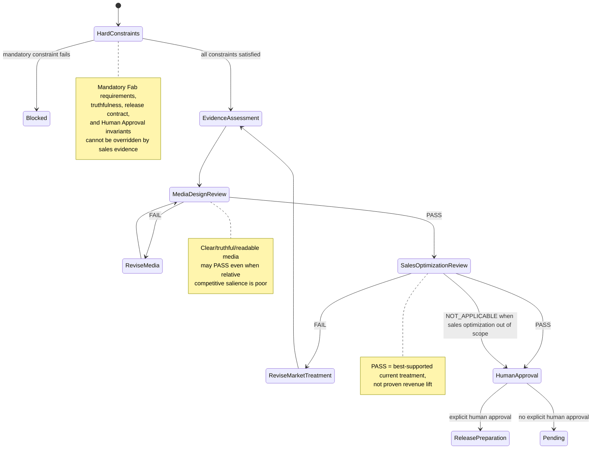

# Fab sales optimization for Unreal Engine listings

Use this guidance when the goal includes sales, revenue, conversion,
discoverability, click-through, pricing, or competitive differentiation. Read
[`media-design.md`](media-design.md) to judge whether media is clear, legible,
truthful, and well composed. Read this file to judge whether the listing is the
best-supported pre-launch treatment for buyer discovery and purchase in the
current market. These are separate reviews; a media-design PASS does not imply a
sales-optimization PASS. See [`evidence.md`](evidence.md) for evidence and
transfer limits.

Fab-specific research that establishes how to maximize sales is limited. Unless
sufficient product-specific controlled evidence exists, a pre-launch PASS means
**best-supported pre-launch treatment under current evidence and market
context**. It is a hypothesis, not proof of sales lift, proven optimality, or a
guarantee. Actual product data takes precedence over pre-launch heuristics when
it is relevant and sufficiently reliable.

## Evidence hierarchy

### Non-overrideable constraints

Evaluate these constraints before comparing optimization evidence. A candidate
that fails any constraint is blocked and MUST NOT proceed to an evidence-ranked
sales review. Distinguish current mandatory Fab requirements and policies from
Fab recommendations or other non-mandatory guidance; the latter may inform
optimization choices but are not automatically requirements.

```ts
interface FabNonOverrideableConstraints {
  currentFabMandatoryRequirementsSatisfied: boolean;
  truthfulRepresentationSatisfied: boolean;
  productAndListingConsistencySatisfied: boolean;
  releaseToolsContractSatisfied: boolean;
  humanApprovalInvariantPreserved: boolean;
}
```

No experiment, sales data, competitor pattern, or heuristic may override a
current mandatory Fab requirement. Higher sales or click-through evidence never
justifies misleading product claims. Human Approval invariants cannot be traded
off for conversion, and the release-tools contract MUST NOT be bypassed for
sales optimization.

### Evidence ranking among compliant treatments

Only after all non-overrideable constraints pass, use evidence in this order to
compare lawful, truthful, contract-compliant treatments. The ranking concerns
optimization evidence; it does not rank or weaken constraints.

```ts
type EvidenceTier =
  | "product_specific_controlled_experiment"
  | "product_specific_observational_data"
  | "current_fab_market_context"
  | "fab_official_guidance"
  | "peer_reviewed_cross_marketplace_research"
  | "other_marketplace_official_guidance"
  | "operational_heuristic";
```

1. Sufficiently reliable controlled experiments on this product.
2. This product's observational sales, impression, click, conversion, or other
   listing data, with confounders recorded.
3. Current Fab direct competitors and nearest substitutes.
4. Current Fab official recommendations and other non-mandatory guidance.
5. Peer-reviewed research across other marketplaces or contexts.
6. Official guidance from other marketplaces.
7. Operational heuristics in this skill.

Current competitor inspection is market context, not causal evidence. Cross-
marketplace research supports bounded hypotheses, not a Fab-specific uplift.
Do not describe a result from a lower evidence tier as stronger than applicable
evidence from a higher tier.

## Sales funnel

Review the whole path to purchase. Click-through alone is not success if the
listing attracts buyers whose needs the product does not meet.

```ts
interface FabSalesFunnel {
  discovery: {
    searchAndFilterRelevance: boolean;
    thumbnailAttention: boolean;
  };
  click: {
    primaryValueClear: boolean;
    differentiatedFromAlternatives: boolean;
  };
  evaluation: {
    realProductEvidence: boolean;
    strongestBenefitsEarly: boolean;
    limitationsClear: boolean;
    trustSignalsPresent: boolean;
  };
  purchase: {
    priceValueCoherent: boolean | "NOT_APPLICABLE";
    priceValueNotApplicableReason?: string;
    buyerRiskReduced: boolean;
  };
}
```

## Current Fab competitor audit

For every sales-optimization request, search current Fab listings for direct
competitors and nearest substitutes. Do not hard-code product names: the market
changes. Record the search date, queries or search scope, findings, and
uncertainty. If no direct competitors appear, record `none found in current
search` and distinguish that from not searching.

```ts
interface FabCompetitorAudit {
  checkedAt: string;
  buyerJob: string;
  directCompetitors: Array<{
    name: string;
    overlap: string;
    primaryMessage: string;
    visualPattern: string;
    priceIfVerified?: string;
  }>;
  nearestSubstitutes: Array<{
    name: string;
    substitutionReason: string;
  }>;
  differentiatedOutcome: string;
}
```

## Pre-launch workflow

Complete these steps in order. If a step fails, revise and resume at the market
audit before final approval.

1. Define the buyer's job and problem.
2. Inspect current Fab direct competitors and nearest substitutes; record the
   audit, including an explicit no-results finding when applicable.
3. Define one primary outcome that differentiates the product for that buyer.
4. Review title, available categories and tags, and buyer search intent.
5. Design thumbnail treatments around the primary outcome and actual product
   evidence.
6. Compare treatments at actual browse/card scale beside current relevant Fab
   alternatives.
7. Design the gallery narrative around buyer outcomes and proof.
8. Review listing copy, FAQ, price, documentation, support, trust, and buyer
   risks or limitations.
9. Run `SALES_OPTIMIZATION_REVIEW` independently of technical and media-design
   reviews.
10. Proceed to Human Approval only after sales review passes; Human Approval
    remains a separate explicit user decision.

## Thumbnail

The thumbnail MUST:

- Be evaluated beside current relevant Fab alternatives in the same browse/card
  context, not only by itself.
- Communicate one primary buyer outcome. Do not make repeating the product name
  the main strategy.
- Show truthful actual product UI, output, or behavior as evidence.
- Keep the primary value and product evidence identifiable at actual card scale.
- Fail sales review when it visually disappears among relevant alternatives.
- Avoid unsupported claims and misleading visuals used to attract attention.

For utilitarian tools such as Unreal Editor utilities, lower visual complexity
is a starting hypothesis, not a universal winning rule. Low complexity does not
mean low salience. Build salience through figure-ground contrast, scale,
hierarchy, whitespace, composition, and one coherent distinctive accent family.
Do not add colors, badges, decorative shapes, or copy merely to appear louder.
No color is universally best for sales. The complexity research and its limits
are summarized in [`evidence.md`](evidence.md).

For a first release or major repositioning, creating two or three materially
different thumbnail treatments is a useful operational heuristic when effort is
proportionate. Two or three is not a research-proven optimum. Compare the same
card dimensions, competitor grid, and product facts while changing the visual
treatment or value emphasis. Review primary-value comprehension, competitive
salience, truthfulness, real product evidence, processing fluency, and relevance
to the buyer's job. Choose the strongest whole-funnel treatment, not simply the
flashiest one.

## Gallery and video

Each gallery image MUST serve one buyer outcome or proof purpose. Put the
strongest differentiated value in the first one to three images. Use actual UI,
output, or behavior; keep every claim matched to its visible evidence; avoid
near-duplicates; caption the buyer outcome rather than only naming a feature;
and keep decorative complexity subordinate to evaluation.

A useful default sequence is core differentiated value, strongest secondary
outcome, second proof or differentiator, workflow or next action, and trust,
scale, or performance evidence. This is an operational heuristic, not a fixed
sequence; adapt it to the buyer's evaluation path.

Use video only when motion explains value better than stills, such as workflow
speed, before/after, direct navigation, or eliminated repetitive steps. Show
real UI in a problem → action → result sequence. Video does not inherently
increase sales. Short duration is an editing heuristic; do not turn another
marketplace's 30-second recommendation into a Fab requirement.

## Listing copy and discovery

Lead with buyer problem → outcome → differentiator. Keep internal implementation
details and long caveats out of the opening. Make important limitations and
exclusions easy to find during evaluation; do not hide them. Explain differences
through this product's actual behavior rather than attacking competitors by
name.

Check the categories and tags currently available in Fab. Choose only relevant
tags that match buyer search intent; do not keyword-stuff or use misleadingly
broad tags. Make the title communicate both search intent and value. Account
for Fab-generated tags from thumbnails when current official documentation
describes that behavior, and ensure the thumbnail truthfully represents the
product.

## Price and value

Review current nearest substitutes, the seller's own portfolio, product scope,
support and maintenance burden, and demonstrated buyer value. Do not infer price
elasticity without evidence. Before launch, do not assume that lower prices
always sell more or that higher prices inherently signal premium quality.
For post-launch experiments, separate price from media or copy changes where
practical so the result remains interpretable.

## Post-launch learning

Do not call sequential before/after changes a controlled experiment when Fab
does not provide a native randomized A/B test. Treat them as observational data.
Record, when available, the period, impressions, listing views, units sold,
revenue, price, thumbnail/media version, copy version, external promotion, and
major confounders. When traffic is low, do not call small differences a winner.
Change one interpretable variable at a time where practical.

## Review state and gate

```ts
type ReviewState = "PASS" | "FAIL" | "PENDING" | "NOT_APPLICABLE";

interface FabListingReviewState {
  technicalValidation: ReviewState;
  mediaDesignReview: ReviewState;
  salesOptimizationReview: ReviewState;
  humanApproval: ReviewState;
}

interface FabAdvisoryReview {
  aiReview?: {
    performed: boolean;
    findings: string[];
  };
}

interface FabSalesOptimizationReview {
  hardConstraints: FabNonOverrideableConstraints;
  marketContextChecked: boolean;
  currentCompetitorsInspected: boolean;
  buyerJobDefined: boolean;
  differentiatedOutcomeDefined: boolean;
  discoveryFieldsReviewed: boolean;
  thumbnailComparedInCompetitiveContext: boolean;
  cardScaleReviewed: boolean;
  listingCopyAligned: boolean;
  pricingContextReviewed: boolean | "NOT_APPLICABLE";
  pricingNotApplicableReason?: string;
  unsupportedClaimsAbsent: boolean;
  evidenceLimitationsRecorded: boolean;
  funnel: FabSalesFunnel;
}
```

`SALES_OPTIMIZATION_REVIEW` is in scope when the user's goal includes sales,
revenue, conversion, discoverability, click-through, pricing, or competitive
differentiation. When it is outside scope, it MAY be `NOT_APPLICABLE`; when any
of those goals is in scope, `NOT_APPLICABLE` MUST NOT be used.

PASS requires every hard-constraint field to be true, every applicable
top-level review field to be true, and every applicable boolean in `funnel` to
be true. `NOT_APPLICABLE` is permitted only for a genuinely irrelevant price
assessment and requires a non-blank reason in the corresponding reason field.
This applies both to `pricingContextReviewed` and to
`funnel.purchase.priceValueCoherent`. `unsupportedClaimsAbsent` and
`evidenceLimitationsRecorded` MUST be true. A missing market inspection,
unsupported claim, absent product evidence, poor competitive salience, unclear
limitations, missing trust signal, incoherent price-value fit, or unreduced
buyer risk is FAIL, not PASS. Strong click or thumbnail-attention results do not
compensate for a failing evaluation or purchase criterion.

AI review is advisory, not a fifth gate. An AI review may provide findings but
does not create a formal PASS state and does not satisfy Technical Validation,
Media Design Review, Sales Optimization Review, or Human Approval. A positive AI
recommendation is not Human Approval.

Keep the four formal gates separate:

- `MEDIA_TECHNICAL=PASS` does not imply `MEDIA_DESIGN_REVIEW=PASS`.
- `MEDIA_DESIGN_REVIEW=PASS` does not imply `SALES_OPTIMIZATION_REVIEW=PASS`.
- `SALES_OPTIMIZATION_REVIEW=PASS` is a best-supported pre-launch hypothesis,
  not proven higher sales.
- `SALES_OPTIMIZATION_REVIEW=PASS` does not imply Human Approval.
- Human Approval rules in [`human-approval.md`](human-approval.md) remain
  unchanged and mandatory.

## Formal state machine


